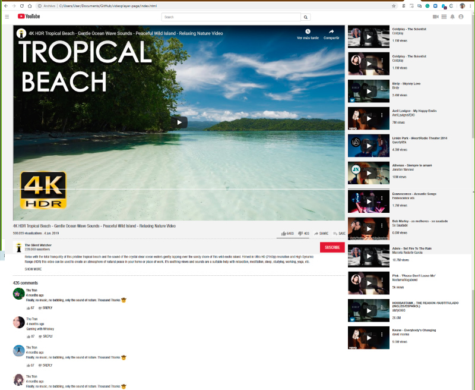

# Embedding Images and Video

We have created a clone for the Youtube´s page, with the video functionality and the thumbnails at the right column, plus decription and comment sections. We completed the project with the help of Visual Studio Code editor, git bash, Nano, Guthub site and github desktop. We also make use of a graphic editor (Illustrator) for making the icons. We have coded this project with Html5 and css3. We also got help from other students at the stand up meeting and from slack. 

This project was created with learning and practice purposes.

## Built With

- HTML
- CSS

## Live Demo

[Live Demo Link](https://meme-es.github.io/videoplayer-page/)

## Authors

👤 **Author1**

- Github: [@meme-es](https://github.com/meme-es)

👤 **Author2**

- Github: [@maosan132](https://github.com/maosan132)

## 🤝 Contributing

Contributions, issues and feature requests are welcome!

Feel free to check the [issues page](issues/).

## Show your support

Give a ⭐️ if you like this project!

## 📝 License

This project is free licensed.